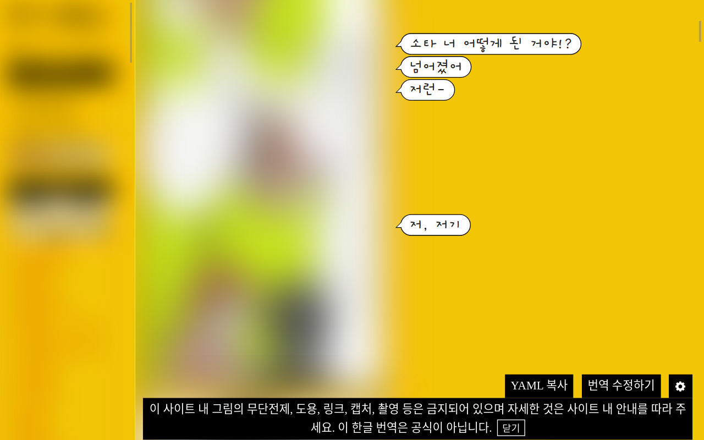

# 호리씨와 미야무라군 번역 크롬 확장프로그램

## :warning: 비공식

이 프로그램은 HERO님과 아무런 관련이 없습니다.
모든 만화 및 대사와 관련된 권리는 HERO님에게 있습니다.

## 호리씨와 미야무라군이란?

호리씨와 미야무라군(줄여서 호리미야)는 일본의 만화가 HERO님이 [자신의 홈페이지](http://dka-hero.me/)에 10년 이상 연재하고 있는 만화로 고등학생 주인공 호리 쿄코와 친구들의 학교 생활을 그리고 있습니다.

호리씨와 미야무라군은 연재 초기에는 한국을 비롯한 몇 외국 블로거 몇이 번역 허가를 받고 각국의 언어로 번역했지만 현재는 모두 철회되어 더 이상 번역을 볼 수 없어, 일본어를 이해할 수 있는 팬들만이 홈페이지에서 그 만화를 보고 있습니다.

호리씨와 미야무라군은 이후 일본 만화 잡지사에 의해 새로운 작화가의 손으로 재탄생하기도 하여 이 작품은 한국에서도 정식 발매되어 인기를 끌고 있습니다.

> 호리미야 - 리디북스
> https://ridibooks.com/books/505014619

## 호리씨와 미야무라군 번역 크롬 확장프로그램

이 프로그램은 [dka-hero.me] 만화 옆에 한국어 번역을 표시하는 [구글 크롬] 확장프로그램입니다.

번역은 진행중에 있습니다.

### 번역 진행도

| 만화                        | 번역 |
| --------------------------- | ---- |
| 호리씨와 미야무라군(본편)   | 5.8% |
| 호리씨와 미야무라군(오마케) | 0%   |
| HERO 단편선                 | 0%   |
| 아코와 밤비                 | ~1화 |

## :wrench: 설치 방법

1. PC+구글 크롬에서만 사용할 수 있습니다!!
   크롬을 쓰고 있지 않다면 [이 링크](https://www.google.com/intl/ko/chrome/)에서 설치해 주세요!!
   모바일로 이 페이지를 보고 계신 경우에도 컴퓨터로 다시 와 주세요

2. [이 링크](https://github.com/aquaclara/hrmy-translate/archive/main.zip)를 눌러 압축 파일을 받아 적당한 장소에 해제합니다.

3. 크롬 주소창에 `chrome://extensions`을 복사해 붙여 넣습니다.

4. "압축해제된 확장 프로그램을 로드" 버튼을 눌러 2에서 압축 푼 폴더를 선택합니다.

5. (필요시) 확장 프로그램의 권한을 변경합니다.

6. [dka-hero.me]을 방문해 보고 싶은 만화를 봅니다.

### :warning: 비공식 Unofficial 非公式

- 이 프로그램은 HERO님과 아무런 관련이 없습니다.
  모든 만화 및 대사와 관련된 권리는 HERO님에게 있습니다.
- This program is unofficial.
- このプログラムは非公式であります。

---

검색 키워드: `호리씨와 미야무라군`, `호리씨와 미야무라군 번역`, `호리씨와 미야무라군 번역`, `호리씨와 미야무라군 번역 보는 곳`, `호리씨와 미야무라군 번역 보는 법`, `호리미야 원작 번역`, `호리미야 원작 보는 곳`, `호리미야 원작 보는 법`, `아코와 밤비`, `아코와 밤비 번역`, `아코와 밤비 번역`, `아코와 밤비 번역 보는 곳`, `아코와 밤비 번역 보는 법`, `아코밤 번역`, `아코밤 보는 곳`, `아코밤 보는 법`, `나의 로스트 일기`, `교감 노트는 말하지 않아`, `미열 디스플레이의 세계`, `겁쟁이색으로 빛나는 캔버스`, `마리아와 지낸 3일간`,`크로커스가 꽃피는, 화단에서`, `모든 희망에 성원을`

[구글 크롬]: https://www.google.com/intl/ko/chrome/
[dka-hero.me]: http://dka-hero.me/
